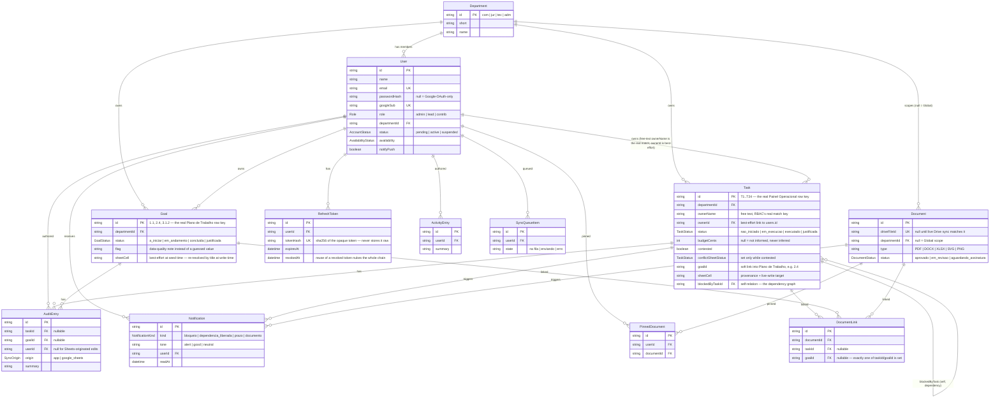

# PTSaq — Database Schema

Source of truth is `backend/prisma/schema.prisma` — this is a reading aid
for it, not a separate spec. PostgreSQL, via Prisma.

## Notes that matter more than the diagram

- **`Task.id` / `Goal.id` are real, human-legible keys** (`T1`, `2.4`),
  not surrogate UUIDs — they're literally the identifiers used in the
  source spreadsheets during the design handoff. This is a deliberate
  departure from "always use a UUID surrogate key": these ids are the
  domain's actual stable identity, and preserving them keeps `sheetCell`
  provenance, dependency links (`blockedByTaskId`), and the frontend's
  `?open=task:T9` deep-linking all trivially readable.
- **RBAC's real authority is `ownerName` (free text), not `ownerId`.**
  `ownerId` is a best-effort link resolved at seed time by matching first
  names; `auth/rbac.ts canEditRow()` checks `ownerName.includes(firstName)`
  directly, because that's what the source data actually guarantees.
  Don't "clean this up" into a hard foreign-key-only check without first
  confirming every row's owner text resolves to a real account.
- **No generic `metadata JSONB` column anywhere.** Every field the app
  reads or writes has a real, typed column. A JSONB catch-all is the
  right call when the shape is genuinely unknown or externally owned;
  here it's fully known (it's two specific spreadsheets), so a loose blob
  would just be the schema declining to enforce what it already knows.
- **`PendingAccountRequest` duplicates a `User` row on purpose** — a
  `pending` `User` already exists at registration time (so RBAC has
  someone to check against the moment they're approved), and the request
  table is the admin-facing queue. Approving one flips both records to
  `active` in a single transaction (`routes/admin.ts`).
